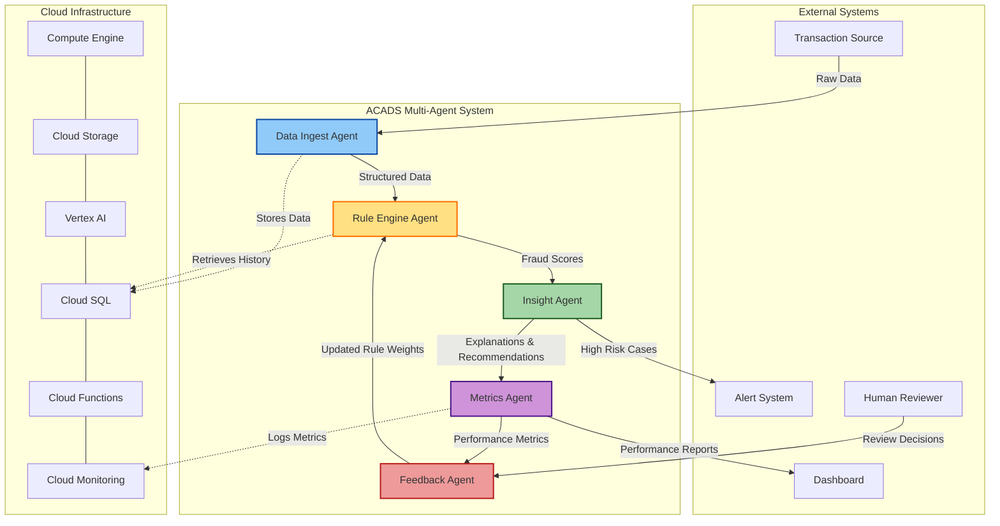

# ACADS Agent Workflow Diagram

The diagram below illustrates the interaction between the five specialized agents in the Agentic Coupon Abuse Detection System (ACADS) and their connections to external systems and cloud infrastructure.

## Agent Workflow Explanation

1. **Data Flow Begins**: Transaction data enters the system from external sources (e-commerce platforms, APIs, batch uploads)

2. **Data Ingest Agent** (Blue):
   - Receives raw transaction data
   - Validates against schema requirements
   - Normalizes and preprocesses data
   - Stores structured data in Cloud SQL

3. **Rule Engine Agent** (Yellow):
   - Retrieves transaction data and historical patterns
   - Applies weighted fraud detection rules
   - Calculates fraud scores and confidence levels
   - Identifies triggered rules and risk levels

4. **Insight Agent** (Green):
   - Receives fraud analysis results
   - Generates human-readable explanations
   - Creates prevention recommendations
   - Routes high-risk cases to alert system

5. **Metrics Agent** (Purple):
   - Calculates performance metrics (precision, recall, F1)
   - Tracks API costs and processing times
   - Logs metrics to Cloud Monitoring
   - Generates reports for dashboards

6. **Feedback Agent** (Red):
   - Processes decisions from human reviewers
   - Updates rule weights based on feedback
   - Identifies new fraud patterns
   - Feeds improved rules back to Rule Engine Agent

7. **Continuous Improvement Loop**: The feedback loop between human reviewers, the Feedback Agent, and the Rule Engine Agent creates a reinforcement learning cycle that continuously improves detection accuracy.

The entire system is deployed on Google Cloud Platform, with each component leveraging specific cloud services for optimal performance, scalability, and reliability. 